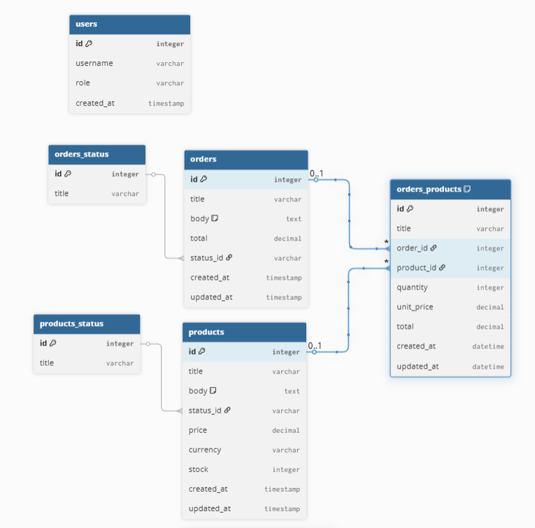

## Steps for run:
requirements: docker and docker compose

## Linux
### Step 1: copy .env.example to .env
```bash
cp .env.example .env
```

### Step 2: start the project
```bash
# Run in detached mode
docker-compose up -d --build

# To stop the containers
docker-compose down

# To view logs
docker-compose logs -f

# Stop containers
docker-compose down
```

### Step 3: run migrations and seed
```bash
# Enter the container
docker exec -it pollux-app bash

# Inside the container, run:
php artisan migrate --seed

# Or directly without entering the container:
docker exec pollux-app php artisan migrate --seed
```

### Step 4:
You are now ready to use it.
User register: http://localhost:8000/admin/register


## diagram db:


### see in = https://dbdiagram.io/d
```
Table users {
  id integer [primary key]
  username varchar
  role varchar
  created_at timestamp
}

Table orders {
  id integer [primary key]
  title varchar
  body text [note: 'Content of the post']
  total decimal
  status_id varchar
  created_at timestamp
  updated_at timestamp
}

Table orders_status {
  id integer [primary key]
  title varchar
}
Ref orders_status: orders.status_id > orders_status.id 

Table products {
  id integer [primary key]
  title varchar
  body text [note: 'Content of the post']
  status_id varchar
  price decimal
  currency varchar
  stock integer
  created_at timestamp
  updated_at timestamp
}

Table products_status {
  id integer [primary key]
  title varchar
}
Ref products_status: products.status_id > products_status.id 

Table orders_products {
  id integer [primary key]
  title varchar
  order_id integer
  product_id integer
  quantity integer
  unit_price decimal
  total decimal
  created_at datetime
  updated_at datetime
  indexes {
    (order_id, product_id) [unique]
  }
}

Ref: orders_products.order_id > orders.id [delete: cascade]
Ref: orders_products.product_id > products.id [delete: restrict]
```